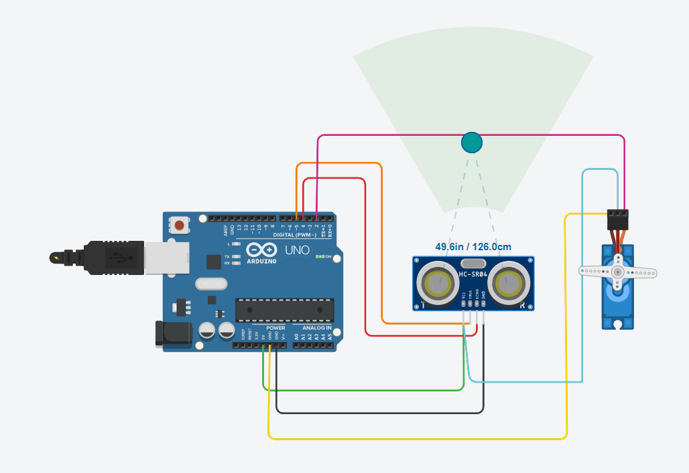

# Automatic-Garage-door-opner (IOT) :

It is a electrical circuit made digitally with the help of Audinio and tinkercad website to open the door of the garage when the car reaches a certain distance from the garage door and closes it after a delay of fixed time by making use of ultrasonic sensor and C++ code

### Ultasonic Sensor :
- It uses ultrasonic waves to determine the distance from an object
- Formula : `distance = (duration/2)*velocity of sound`
- Range of a ultrasonic sensor is `2cm to 4m`
- Measuring angle is 15 degree
- Working current is 15 mAmphere
- We get pulses from ultrasonic sensor
___
### Prerequisities :
- Basic knowladge of electical circuit
- Account on tinkercard website
- Basic knowladge of Audinio
- Basic knowladge of C++
___

### How to use :
- SignUp/SignIn to [tinkercad.com](https://www.tinkercad.com/)
- Make the circuit as shown in [image of closed circuit](./images/closed.png)
- Write the code as given in code file
- Click on stimulation to run 
- Adjust the distance and see the result
___

### Circuit Screenshots :

>Closed circuit ( Object at a distance of 162.9cm) :

>Open circuit (Object at a distance of 126.0cm) :

